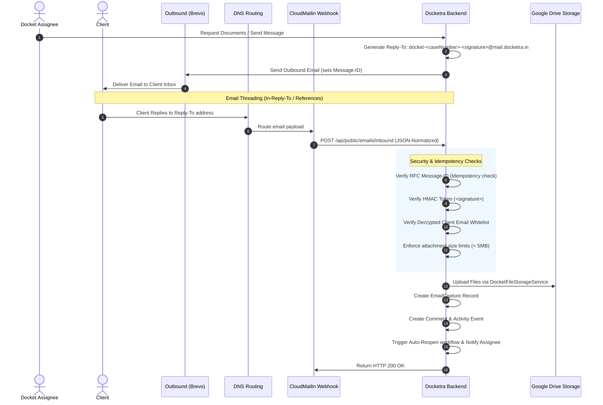

# Inbound Docket Email Integration

This document defines the production implementation, workflow, data model, security, and idempotency architectures for Docketra's Inbound Email Integration.

---

## 1. End-to-End Sequence Diagram



---

## 2. Inbound Workflow & Threading

### A. Outbound Email & Reply-To Generation
When an assignee requests documents from a client:
1. An outbound email is dispatched via **Brevo**.
2. A custom, cryptographically secure `Reply-To` address is injected:
   `docket-<caseNumber>-<signature>@mail.docketra.in`
3. The `<signature>` token is statefully calculated using:
   `HMAC-SHA256(caseInternalId, SYSTEM_HASH_SECRET)` truncated to 6 hex characters.
4. The email headers are injected with a unique `Message-ID`.

### B. Reply-by-Email Threading
When the client clicks "Reply" in their email client:
1. The reply is sent back to the unique `Reply-To` address.
2. The client's mail server automatically appends `In-Reply-To` and `References` headers mapping to Docketra's original `Message-ID`.
3. CloudMailin normalization forwards these threading headers in the `headers` block, allowing Docketra to associate replies with the original outbound email log thread.

---

## 3. Webhook Parsing & Core Business Logic

Upon receiving the payload at `POST /api/public/emails/inbound`:

### A. Automatic Comment & Attachment Creation
* Extract plain/HTML body excerpts and create an `EmailCapture` record.
* Upload base64 attachment contents directly to the associated case folder in **Google Drive** via `DocketFileStorageService.uploadFile`.
* Format a new system-authored case `Comment` listing all uploaded files:
  ```text
  Received client email: "Re: Document Request" from client@company.com.
  Attached files: passport.pdf, pancard.png
  ```

### B. State Workflow (Auto-Reopen Rules)
* **Reopen Condition**: The docket state will automatically reopen (`PENDED` -> `REOPENED` / `ACTIVE`) **only** if the current status is `PENDING` and the reason is `waiting_client`.
* If the case is in any other status (e.g. `CLOSED` or `IN_PROGRESS`), the incoming files are attached to the timeline but the case state is left unchanged.

### C. Assignee Notification Flow
* Once the docket reopens, a target system notification is sent to the docket assignee (`assignedToXID`) notifying them that the client has responded with attachments.

---

## 4. Security & Error Handling

### A. Public Error Response Masking
To prevent timing attacks or information leaks in production, all webhook validation errors are masked with generic response codes:

* **HTTP 400 Bad Request**: Mismatched parameters, missing fields, or oversized attachments return:
  ```json
  {
    "success": false,
    "code": "INVALID_REQUEST",
    "message": "Human readable reason here",
    "requestId": "unique-request-id-string"
  }
  ```
* **HTTP 403 Forbidden**: Invalid token signature or unauthorized sender emails return:
  ```json
  {
    "success": false,
    "code": "FORBIDDEN",
    "message": "Sender email is not authorized for this client docket.",
    "requestId": "unique-request-id-string"
  }
  ```

### B. Audit Events Logged
The integration registers the following system events:
* `EMAIL_SENT`: Logged upon outbound Brevo dispatch.
* `CLIENT_RESPONDED`: Logged when the inbound webhook receives a valid client reply.
* `ATTACHMENT_RECEIVED`: Logged when attachments are successfully uploaded to Google Drive.
* `PENDING_REOPENED`: Logged when the docket is automatically reopened.

---

## 5. Idempotency Model

Since external webhook providers cannot deliver custom `Idempotency-Key` headers:
1. **Route Bypass**: The webhook route `/api/public/emails/inbound` is exempted from the global API idempotency middleware.
2. **RFC Message-ID Deduplication**: The controller extracts `headers.message_id`. If a duplicate is received (due to retry loops or transient network errors), it verifies existence in the database and immediately returns `200 OK` with the cached `emailCaptureId`, avoiding duplicate files, comments, or state mutations.
3. **Upload Constraints**: Any attachments exceeding `SECURITY_UPLOAD_MAX_SIZE_MB` (default `5MB`) are immediately rejected with `400 INVALID_REQUEST` to prevent resource abuse.
